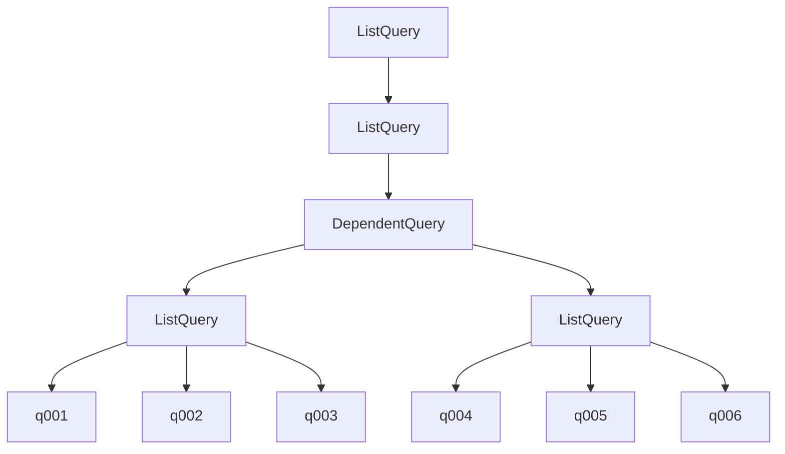
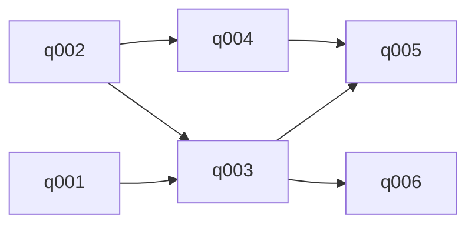
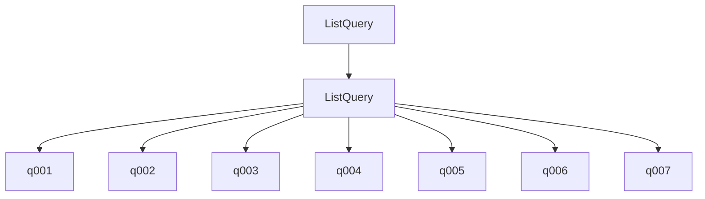
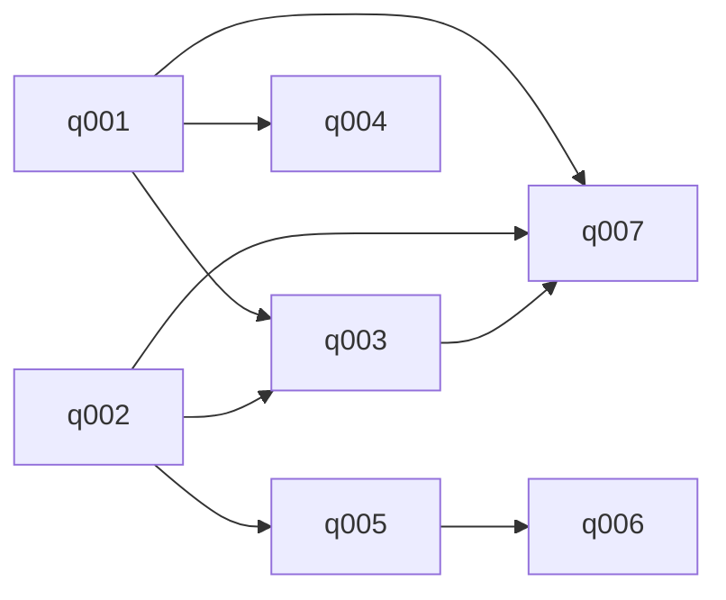

# Jurisynth leaf execution / retry / AST follow-up

## Changes since the observed runs

At the owner’s request the current Reasoner NIM wrapper and retrieval ImageExpander no longer transmit max_tokens or max_completion_tokens. Legacy adapter budget arguments remain accepted for compatibility but are ignored by the shared NIM wrapper; they are not applied output caps. Provider default limits still exist: omitted does not mean infinite output. Prompts, schemas, retry rules, temperature=0 and top_p=.000001 remain unchanged. KG construction’s separate llm_utils and Image Processor configs are not changed. No API rerun was performed for this patch. The v10 logs describe the old explicit caps; do not assume their metadata describes the patched code.

## Questions for Chat

Diagnose the large uninstrumented retrieval intervals, shared semaphore/FAISS/embedding contention, sequential image expansion and dependency barriers. Distinguish confirmed causes from hypotheses. Propose scoped instrumentation and experiments before changes. Inspect provider-default output limits as a remaining uncertainty, not a guarantee against truncation. Keep the source KG pipeline prompt frozen. NLI/retrieval relevance is not evaluated by a success-status event.

## Evidence limitations

Full leaf answers, final report responses, internal per-search spans, Omni expansion calls and complete evidence bundles were not checkpointed on report failure. The available retrieval events contain total duration, status, evidence IDs and table IDs, not evidence text/scores/individual stage durations. Complete API retry events and raw logs are packaged. NIM logs lack query IDs: per-leaf API correlation is inferred, ambiguous calls stay unassigned with candidate leaves. Times overlap; do not sum them as run duration. Most interpretation intervals cannot be uniquely assigned to concurrent leaves.

## messy: retry locations

- conversation_intake: 1 HTTP 503 retries.
- task_analysis: 1 HTTP 503 retries.
- evidence_grounded_leaf_answer: 8 HTTP 503 retries.
- retrieval_concepts: 1 HTTP 503 retries.

All logged Ultra retry statuses: {503: 11}. Separate vision-client retries are not in these logs.

### AST versus actual execution plan

The parser AST records expression structure. The semantic planner then changes required leaf dependencies; these are separate artifacts. q-numbers below follow atomic expression traversal. Exact leaf text is included in parsed_AST.json.



Execution DAG after semantic planning:



- q001: Under the EU AI Act, who qualifies as the 'provider' of a high-risk AI system when a non-EU manufacturer sells through an EU importer/distributor to a hospital, and can the hospital become a provider by modifying or fine-tuning the system post-deployment?

- q002: Does an AI system used for medical treatment decisions that processes patient health and biometric data automatically qualify as high-risk under the AI Act, or are additional conditions required beyond its classification as a medical device?

- q003: What are the specific obligations of providers, importers/distributors, and deployers (hospitals) under the AI Act for high-risk AI systems that are also medical devices, particularly regarding post-market monitoring, incident reporting, and conformity assessment after software updates?

- q004: Using {upstream_result}, Under GDPR, can patient health and biometric data processed for healthcare purposes be lawfully reused to train or improve an AI model without additional legal basis, and what safeguards (e.g., Art. 89, purpose limitation, DPIA) apply?

- q005: Using {upstream_result}, Does compliance with the AI Act (e.g., data governance, transparency, human oversight) satisfy GDPR requirements for the same processing activities, or are the two regimes legally distinct with separate compliance obligations and enforcement?

- q006: Using {upstream_result}, When a software update causes degraded performance for a specific patient group, what triggers a 'serious incident' under the AI Act vs. a mere performance issue, who (provider, importer, deployer) has the primary duty to detect, report, and remediate it, and how do MDR/IVDR vigilance obligations interact with AI Act post-market monitoring?

### Per-leaf retrieval and generation minutes

- q001: retrieval 4.70; answer generation 6.06; uninstrumented retrieval remainder at least 0.00 (conservative temporal bound, not CPU time).

- q002: retrieval 6.36; answer generation 4.80; uninstrumented retrieval remainder at least 1.41 (conservative temporal bound, not CPU time).

- q003: retrieval 12.63; answer generation 4.56; uninstrumented retrieval remainder at least 6.07 (conservative temporal bound, not CPU time).

- q004: retrieval 16.33; answer generation 2.21; uninstrumented retrieval remainder at least 9.78 (conservative temporal bound, not CPU time).

- q005: retrieval 23.80; answer generation 10.07; uninstrumented retrieval remainder at least 21.00 (conservative temporal bound, not CPU time).

- q006: retrieval 14.91; answer generation 15.90; uninstrumented retrieval remainder at least 12.11 (conservative temporal bound, not CPU time).

### Exact retry events

```json
[
  {
    "attempt": 1,
    "backoff_seconds": 1.352,
    "call_id": "b8e21571632b4fcb911387e9d5e71f63",
    "elapsed_seconds": 207.224,
    "error_type": "InternalServerError",
    "event": "nim_retry_scheduled",
    "run_id": "global_smoke",
    "status_code": 503,
    "timestamp": "2026-09-13T16:20:48.917624+00:00",
    "transport_exception_chain": [],
    "stage": "conversation_intake",
    "query_id_if_correlated": null,
    "candidate_query_ids": [],
    "leaf_association": "outside leaf execution"
  },
  {
    "attempt": 1,
    "backoff_seconds": 1.977,
    "call_id": "3cf4909384004f5fbdff1c2c156f1bcf",
    "elapsed_seconds": 170.384,
    "error_type": "InternalServerError",
    "event": "nim_retry_scheduled",
    "run_id": "global_smoke",
    "status_code": 503,
    "timestamp": "2026-09-13T16:26:57.459154+00:00",
    "transport_exception_chain": [],
    "stage": "task_analysis",
    "query_id_if_correlated": null,
    "candidate_query_ids": [],
    "leaf_association": "outside leaf execution"
  },
  {
    "attempt": 1,
    "backoff_seconds": 1.95,
    "call_id": "f2d57056424d4cd7a9be24e7e6c98800",
    "elapsed_seconds": 145.926,
    "error_type": "InternalServerError",
    "event": "nim_retry_scheduled",
    "run_id": "global_smoke",
    "status_code": 503,
    "timestamp": "2026-09-13T16:43:30.033411+00:00",
    "transport_exception_chain": [],
    "stage": "evidence_grounded_leaf_answer",
    "query_id_if_correlated": "q002",
    "candidate_query_ids": [
      "q001",
      "q002"
    ],
    "leaf_association": "inferred from immediate phase-boundary timestamp"
  },
  {
    "attempt": 1,
    "backoff_seconds": 1.186,
    "call_id": "fbfe6cef12294cfc8659fc9e092d8790",
    "elapsed_seconds": 147.417,
    "error_type": "InternalServerError",
    "event": "nim_retry_scheduled",
    "run_id": "global_smoke",
    "status_code": 503,
    "timestamp": "2026-09-13T16:48:23.283623+00:00",
    "transport_exception_chain": [],
    "stage": "retrieval_concepts",
    "query_id_if_correlated": null,
    "candidate_query_ids": [
      "q003",
      "q004"
    ],
    "leaf_association": "not correlated"
  },
  {
    "attempt": 1,
    "backoff_seconds": 1.186,
    "call_id": "18ed7aa6b2204f4ba6dfea7be2bda138",
    "elapsed_seconds": 146.227,
    "error_type": "InternalServerError",
    "event": "nim_retry_scheduled",
    "run_id": "global_smoke",
    "status_code": 503,
    "timestamp": "2026-09-13T17:21:45.474792+00:00",
    "transport_exception_chain": [],
    "stage": "evidence_grounded_leaf_answer",
    "query_id_if_correlated": "q006",
    "candidate_query_ids": [
      "q006"
    ],
    "leaf_association": "only active leaf in this phase; temporal inference"
  },
  {
    "attempt": 2,
    "backoff_seconds": 2.567,
    "call_id": "18ed7aa6b2204f4ba6dfea7be2bda138",
    "elapsed_seconds": 129.767,
    "error_type": "InternalServerError",
    "event": "nim_retry_scheduled",
    "run_id": "global_smoke",
    "status_code": 503,
    "timestamp": "2026-09-13T17:23:56.446866+00:00",
    "transport_exception_chain": [],
    "stage": "evidence_grounded_leaf_answer",
    "query_id_if_correlated": "q006",
    "candidate_query_ids": [
      "q006"
    ],
    "leaf_association": "only active leaf in this phase; temporal inference"
  },
  {
    "attempt": 3,
    "backoff_seconds": 4.134,
    "call_id": "18ed7aa6b2204f4ba6dfea7be2bda138",
    "elapsed_seconds": 118.456,
    "error_type": "InternalServerError",
    "event": "nim_retry_scheduled",
    "run_id": "global_smoke",
    "status_code": 503,
    "timestamp": "2026-09-13T17:25:57.483542+00:00",
    "transport_exception_chain": [],
    "stage": "evidence_grounded_leaf_answer",
    "query_id_if_correlated": "q006",
    "candidate_query_ids": [
      "q006"
    ],
    "leaf_association": "only active leaf in this phase; temporal inference"
  },
  {
    "attempt": 1,
    "backoff_seconds": 1.103,
    "call_id": "e064fbf42bfa4a4ebf53422ae1743e0e",
    "elapsed_seconds": 137.976,
    "error_type": "InternalServerError",
    "event": "nim_retry_scheduled",
    "run_id": "global_smoke",
    "status_code": 503,
    "timestamp": "2026-09-13T17:30:37.650843+00:00",
    "transport_exception_chain": [],
    "stage": "evidence_grounded_leaf_answer",
    "query_id_if_correlated": "q006",
    "candidate_query_ids": [
      "q005",
      "q006"
    ],
    "leaf_association": "inferred validation-call continuation from immediate preceding completion"
  },
  {
    "attempt": 1,
    "backoff_seconds": 1.008,
    "call_id": "10bf83b53e4245aa9d6765868c0195ad",
    "elapsed_seconds": 136.053,
    "error_type": "InternalServerError",
    "event": "nim_retry_scheduled",
    "run_id": "global_smoke",
    "status_code": 503,
    "timestamp": "2026-09-13T17:32:51.261340+00:00",
    "transport_exception_chain": [],
    "stage": "evidence_grounded_leaf_answer",
    "query_id_if_correlated": "q005",
    "candidate_query_ids": [
      "q005",
      "q006"
    ],
    "leaf_association": "inferred validation-call continuation from immediate preceding completion"
  },
  {
    "attempt": 2,
    "backoff_seconds": 2.957,
    "call_id": "e064fbf42bfa4a4ebf53422ae1743e0e",
    "elapsed_seconds": 137.432,
    "error_type": "InternalServerError",
    "event": "nim_retry_scheduled",
    "run_id": "global_smoke",
    "status_code": 503,
    "timestamp": "2026-09-13T17:32:56.654344+00:00",
    "transport_exception_chain": [],
    "stage": "evidence_grounded_leaf_answer",
    "query_id_if_correlated": "q006",
    "candidate_query_ids": [
      "q005",
      "q006"
    ],
    "leaf_association": "inferred validation-call continuation from immediate preceding completion"
  },
  {
    "attempt": 2,
    "backoff_seconds": 2.913,
    "call_id": "10bf83b53e4245aa9d6765868c0195ad",
    "elapsed_seconds": 188.949,
    "error_type": "InternalServerError",
    "event": "nim_retry_scheduled",
    "run_id": "global_smoke",
    "status_code": 503,
    "timestamp": "2026-09-13T17:36:01.227245+00:00",
    "transport_exception_chain": [],
    "stage": "evidence_grounded_leaf_answer",
    "query_id_if_correlated": "q005",
    "candidate_query_ids": [
      "q005",
      "q006"
    ],
    "leaf_association": "inferred validation-call continuation from immediate preceding completion"
  }
]
```

### Available retrieval events

```json
[
  {
    "duration_ms": 282156.0,
    "event": "retrieval_completed",
    "evidence_ids": [
      "E_05c83c86b862ed09",
      "E_1c3e5686d0cacf51",
      "E_714023068978abc0",
      "E_a7670673d8600813",
      "E_d733bf21cdffb64c",
      "E_f37df9a9646e6991",
      "E_4253bb581f8024c4",
      "E_03ef8f30a7db7704",
      "E_34bc33bc3abc531c",
      "E_3f9c3ac1051bdb5a",
      "E_9c48b3c4a839c797",
      "E_a64d89ca2c9778e2",
      "E_d71fbad65de7ca8e",
      "E_e2aceb86ba0e8379",
      "E_1334fd12c23edcdc",
      "E_1801d0a08b16ec67",
      "E_dcd85c07caa238e6",
      "E_f16df09911c8560f",
      "E_f5d67de6594373bf",
      "E_5ada1f4bacfd50bd",
      "E_10232bfc057c5a3b",
      "E_6cf3c6bc2ea15298",
      "E_125e38de06c62c56",
      "E_247d32c4fb35f87e",
      "E_28bf5e1c83d13a6d",
      "E_99a62586c5d11b79",
      "E_76ab9120a1aff4fb",
      "E_90fb80fadb5a4fd2",
      "E_a5c5c7435e41fed6",
      "E_119bc17a94716382",
      "E_67123134cc40204e",
      "E_747ace15ef144368",
      "E_7760538fe959eca7",
      "E_058a36b42f585c27",
      "E_54f13b9d84eda53e",
      "E_677ec889daee01bb",
      "E_e8f67c2b0b3337d6",
      "C_d7e407446b4e4c46",
      "C_281cd2b8b066dd74",
      "C_b855104cb03c90c0",
      "C_44d17aacd4923a7b",
      "C_793c1d26de5d7b06",
      "C_003a92b8554e410d",
      "C_8311bca858a8fdba",
      "C_e75305e9d3f0c538"
    ],
    "query_id": "q001",
    "retrieval_status": "success",
    "run_id": "global_smoke",
    "table_ids": [
      "table_17",
      "table_17",
      "table_17",
      "table_17",
      "table_17"
    ],
    "timestamp": "2026-09-13T16:39:24.923381+00:00"
  },
  {
    "duration_ms": 381328.0,
    "event": "retrieval_completed",
    "evidence_ids": [
      "E_05c83c86b862ed09",
      "E_0a194fca64e4affb",
      "E_0a9a79a636a2f7f0",
      "E_0bc5d3583a042e75",
      "E_115d551f48f0736b",
      "E_195933dae587590e",
      "E_1c3e5686d0cacf51",
      "E_22b34d4cf2009cee",
      "E_2bf4c3c98465bcde",
      "E_4b15a63c60095b6b",
      "E_4edfb8b865e67f83",
      "E_69dc3ff43711bc80",
      "E_714023068978abc0",
      "E_7aad0b44113c992e",
      "E_7ca946de151127a7",
      "E_8515a8631314affe",
      "E_916ca3b5fd66a8e0",
      "E_9d0ffa1117db1b14",
      "E_a627fc7db67d98d1",
      "E_a7670673d8600813",
      "E_aba308243c4ca2b3",
      "E_bb730031ad31c08e",
      "E_c86d01f6c03f520a",
      "E_cb0274137a2e9067",
      "E_cc9892f188a8f68a",
      "E_d733bf21cdffb64c",
      "E_dbd05afd253f333d",
      "E_e8f0fd46a870df6c",
      "E_ea41cecc0446e8d4",
      "E_f37df9a9646e6991",
      "E_f7d99f870acc31a4",
      "E_02ab3e079b559e24",
      "E_b19c6f2b08362f9b",
      "E_c6f6d7387f42b8b5",
      "E_031e7eaeb411a84b",
      "E_a05073383d4064a6",
      "E_c396ec08294d0775",
      "E_03ef8f30a7db7704",
      "E_34bc33bc3abc531c",
      "E_3f9c3ac1051bdb5a",
      "E_9c48b3c4a839c797",
      "E_a64d89ca2c9778e2",
      "E_d71fbad65de7ca8e",
      "E_e2aceb86ba0e8379",
      "E_1334fd12c23edcdc",
      "E_1801d0a08b16ec67",
      "E_244b201784266da4",
      "E_2fed05a194118b93",
      "E_32e8ffe66dd8d980",
      "E_43bf3fef91d1ca33",
      "E_8d3a9da5db676e58",
      "E_af6b1283e31e96ac",
      "E_10232bfc057c5a3b",
      "E_cbb69c1918492f3f",
      "E_3e5d3efeb4458326",
      "E_80dccac1120f89da",
      "E_77f7eaa2878cf28a",
      "E_9e2c0c94b64aeae6",
      "E_c43712feecf519f7",
      "E_ff6480e50cd7b590",
      "C_a460157c25b0deb1",
      "C_003a92b8554e410d",
      "C_281cd2b8b066dd74",
      "C_955309d68469a5b1",
      "C_876ea19ce7bd3c5d",
      "C_04c8af0eb7a8ba85",
      "C_f861bb03ffcbf679",
      "C_384a4a62c7087693"
    ],
    "query_id": "q002",
    "retrieval_status": "success",
    "run_id": "global_smoke",
    "table_ids": [
      "table_23",
      "table_23",
      "table_1",
      "table_1",
      "table_1"
    ],
    "timestamp": "2026-09-13T16:41:04.103172+00:00"
  },
  {
    "duration_ms": 757812.0,
    "event": "retrieval_completed",
    "evidence_ids": [
      "E_115d551f48f0736b",
      "E_15947cb1b8085e8e",
      "E_16ce1f9a8503d352",
      "E_195933dae587590e",
      "E_1eb18ba300c5417e",
      "E_1f380144c01c0484",
      "E_210eaae1a1cf2587",
      "E_22b34d4cf2009cee",
      "E_235a7acbfca0ad4c",
      "E_2bf4c3c98465bcde",
      "E_2c8802ce5bb0e845",
      "E_32c645455046a48c",
      "E_4b15a63c60095b6b",
      "E_4d4162ecb53f5882",
      "E_4edfb8b865e67f83",
      "E_516528faf17ccdde",
      "E_67ad2e8a955fa3f2",
      "E_69dc3ff43711bc80",
      "E_71c234fa58075379",
      "E_7aad0b44113c992e",
      "E_94e6e330b4399573",
      "E_9d0ffa1117db1b14",
      "E_a627fc7db67d98d1",
      "E_aba308243c4ca2b3",
      "E_afed76067faf70e1",
      "E_c655d8e666ea607a",
      "E_cc9892f188a8f68a",
      "E_d1aa443ff636ad1c",
      "E_d6a81db7f54924ee",
      "E_d70153f9bdfe2657",
      "E_dbd05afd253f333d",
      "E_ddf64c6d0d0e15da",
      "E_1c3e5686d0cacf51",
      "E_075f77f8286859c2",
      "E_4afb899a9b280260",
      "E_895e42ca1a1903a4",
      "E_eba19b1db648894b",
      "E_244b201784266da4",
      "E_40637ab613f0fef8",
      "E_60d421517efb715c",
      "E_6e8248d6236faae9",
      "E_9cbca9cf15fc3ff7",
      "E_eb7e3ed7eca5c76a",
      "E_fe2dd71cd1801c97",
      "E_9e45e1145a2e574c",
      "E_3e5d3efeb4458326",
      "E_a7670673d8600813",
      "E_b7e2e84898d3b291",
      "E_ccc5dc94b4b405d4",
      "E_d1d02f21b3f045fd",
      "E_76fe72034182bd6c",
      "E_8848d08a57adfb06",
      "E_1db0565bb7421f2e",
      "E_54d61e7b26d18465",
      "E_c52afd61cb059be0",
      "E_d2309a99943aceb6",
      "E_119bc17a94716382",
      "E_67123134cc40204e",
      "E_747ace15ef144368",
      "E_7760538fe959eca7",
      "C_39bd34fbf455c5fe",
      "C_44d17aacd4923a7b",
      "C_281cd2b8b066dd74",
      "C_b855104cb03c90c0",
      "C_2c73a75719d9f050",
      "C_3fd36830bdb16488",
      "C_955309d68469a5b1",
      "C_05dca3f7f22a243c"
    ],
    "query_id": "q003",
    "retrieval_status": "success",
    "run_id": "global_smoke",
    "table_ids": [
      "table_23",
      "table_7",
      "table_23",
      "table_7",
      "table_2"
    ],
    "timestamp": "2026-09-13T16:58:29.674343+00:00"
  },
  {
    "duration_ms": 980093.0,
    "event": "retrieval_completed",
    "evidence_ids": [
      "E_1c3e5686d0cacf51",
      "E_2fe3a3cc41f91c91",
      "E_563c754b8ca04197",
      "E_6cc2530ce8149b17",
      "E_714023068978abc0",
      "E_7a7f5a3a5cee039f",
      "E_91cc6cc5135af782",
      "E_ad03283ede56c14a",
      "E_ae5abac8830cdbfe",
      "E_afed76067faf70e1",
      "E_c5611d5b4bd361ad",
      "E_0070120dde83c10f",
      "E_02964ceb5135786a",
      "E_065ef1cde9a8d7de",
      "E_07ae4fc5e245e148",
      "E_0897f70bace0159e",
      "E_0ab9560acbc563ea",
      "E_10232bfc057c5a3b",
      "E_113e22278b509ff4",
      "E_122167daf6c549ee",
      "E_13423c3fc0665a01",
      "E_15da0c2607cef005",
      "E_18d3094a769d6705",
      "E_1a9c384476ea8214",
      "E_228718abd0b1f57d",
      "E_229b7b0b585173f0",
      "E_236da87c08c18b32",
      "E_24c42dd91e36c51e",
      "E_2f08a8e37420f433",
      "E_31ff05f5dfa03d91",
      "E_36af34db83bf6953",
      "E_3a235cfdf6415c64",
      "E_3d4f9204dc4e8cfb",
      "E_40e2fe2fce270bfc",
      "E_41f9da5e24477df7",
      "E_49a32ac47c7c94dc",
      "E_4af4470761d33182",
      "E_4b6369dbd8325511",
      "E_4b6e28495f1a613c",
      "E_522eb6f5afb488bf",
      "E_54468fae3e970a88",
      "E_5d7b841a1be45085",
      "E_5dd815d301d961fc",
      "E_611530b1da282ebd",
      "E_6299d9abf71a1c28",
      "E_65a73aba8644b018",
      "E_6e7331675520e246",
      "E_6fdf8704170cf910",
      "E_7582c9315ef88080",
      "E_7cd26ccf89f00fb6",
      "E_7dfcf949af86fb84",
      "E_84159551acfbb93c",
      "E_8964ccbe19964756",
      "E_989066a8d0f683d1",
      "E_99e579ee72aa1490",
      "E_9c55eadd427695d7",
      "E_9e45e1145a2e574c",
      "E_9ea060efee70855b",
      "E_aa09abe7722f8fed",
      "E_b44626cda439f5c4",
      "C_003a92b8554e410d",
      "C_6a91341b406a70cf",
      "C_281cd2b8b066dd74",
      "C_9fe4242a206c045c",
      "C_b78479bc97e103cc",
      "C_b3725abaf9f6feba"
    ],
    "query_id": "q004",
    "retrieval_status": "success",
    "run_id": "global_smoke",
    "table_ids": [
      "table_33",
      "table_1",
      "table_2",
      "table_1",
      "table_1"
    ],
    "timestamp": "2026-09-13T17:02:11.950134+00:00"
  },
  {
    "duration_ms": 894531.0,
    "event": "retrieval_completed",
    "evidence_ids": [
      "E_1eb18ba300c5417e",
      "E_05c83c86b862ed09",
      "E_1c3e5686d0cacf51",
      "E_22b34d4cf2009cee",
      "E_2bf4c3c98465bcde",
      "E_4b15a63c60095b6b",
      "E_4edfb8b865e67f83",
      "E_4fb721d52afdd1fe",
      "E_63d53b2041f9b70f",
      "E_69dc3ff43711bc80",
      "E_6f0e08264fe6b67a",
      "E_714023068978abc0",
      "E_7aad0b44113c992e",
      "E_88ed5a45af824f98",
      "E_9d0ffa1117db1b14",
      "E_a627fc7db67d98d1",
      "E_a7670673d8600813",
      "E_cb29947f65e94459",
      "E_d6a81db7f54924ee",
      "E_d733bf21cdffb64c",
      "E_dbd05afd253f333d",
      "E_f37df9a9646e6991",
      "E_03ef8f30a7db7704",
      "E_34bc33bc3abc531c",
      "E_3f9c3ac1051bdb5a",
      "E_5efb8211c848c5e5",
      "E_81849f6b1d60bedc",
      "E_970fe1ff58e0a8f4",
      "E_9c48b3c4a839c797",
      "E_a64d89ca2c9778e2",
      "E_d71fbad65de7ca8e",
      "E_e2aceb86ba0e8379",
      "E_e4501b0a4ce6c1c7",
      "E_eba19b1db648894b",
      "E_f6e8d139d3a23d88",
      "E_1334fd12c23edcdc",
      "E_1801d0a08b16ec67",
      "E_5ebf4ed33793abfd",
      "E_b866d607f006f61f",
      "E_e256041a926e96c1",
      "E_10232bfc057c5a3b",
      "E_e1ea603f0c924f41",
      "E_3e0c80f8ddb37ed0",
      "E_8923698b14f71b16",
      "E_f0d283cf66eddc2b",
      "E_228724fab4bd51bf",
      "E_0c793592d7a92577",
      "E_0df1d58586227986",
      "E_529c46a70342bde4",
      "E_80dccac1120f89da",
      "E_77f7eaa2878cf28a",
      "C_3fd36830bdb16488",
      "C_d227020368a94504",
      "C_281cd2b8b066dd74",
      "C_f65fbd79f8343d8d",
      "C_2c73a75719d9f050",
      "C_05dca3f7f22a243c"
    ],
    "query_id": "q006",
    "retrieval_status": "success",
    "run_id": "global_smoke",
    "table_ids": [
      "table_7",
      "table_7",
      "table_9",
      "table_1",
      "table_1"
    ],
    "timestamp": "2026-09-13T17:19:19.222851+00:00"
  },
  {
    "duration_ms": 1428172.0,
    "event": "retrieval_completed",
    "evidence_ids": [
      "E_00e820767fc9684f",
      "E_02e40e798c38db67",
      "E_048d383d1eb26ccc",
      "E_05c83c86b862ed09",
      "E_098578f1f10efddb",
      "E_09f16567cd64c88b",
      "E_0d7a7abc8986a2e1",
      "E_12c74bbfc0b88902",
      "E_12d9e5f9b0e5d936",
      "E_13df6329bcda8208",
      "E_17cb3dca65893d08",
      "E_1c3e5686d0cacf51",
      "E_1eb18ba300c5417e",
      "E_22aa83b5f38a2f29",
      "E_2379fb9317b05301",
      "E_2c6b418fb36dea3b",
      "E_2fe3a3cc41f91c91",
      "E_307e8b40189b3011",
      "E_31a7defa06531bcd",
      "E_399cc835be9195d8",
      "E_39c11909947d0ca3",
      "E_39e18a747e1dd7ea",
      "E_4b171fb4137594ba",
      "E_4b6369dbd8325511",
      "E_516528faf17ccdde",
      "E_51b3b432e56992ec",
      "E_563c754b8ca04197",
      "E_57f48be390777519",
      "E_6ba96b74a46aff08",
      "E_6cc2530ce8149b17",
      "E_714023068978abc0",
      "E_7a7f5a3a5cee039f",
      "E_9104c10fd48ba52d",
      "E_91cc6cc5135af782",
      "E_92677c3299a3afca",
      "E_9663cbb18e908292",
      "E_9e588942b18f8c9a",
      "E_a1afc9b5a00cdb20",
      "E_a1deb3c48aa6c9ef",
      "E_a7670673d8600813",
      "E_a8e41e867c0d1668",
      "E_a9ca2d34b75c7afc",
      "E_ae5abac8830cdbfe",
      "E_b4926fbe56e6977e",
      "E_b71b97c5235dd6d3",
      "E_b7d35a3f98213025",
      "E_bd645045dddf1517",
      "E_bfa32ab592be9675",
      "E_c1dae8a33c0565b2",
      "E_c5611d5b4bd361ad",
      "E_c8102d71ce49c0d9",
      "E_cc9892f188a8f68a",
      "E_d0742aa354fb9d72",
      "E_d6a81db7f54924ee",
      "E_d733bf21cdffb64c",
      "E_dd785ca4f90b5fd2",
      "E_e25ae33e62da63ce",
      "E_e4501b0a4ce6c1c7",
      "E_e46163cd65bd3061",
      "E_f37df9a9646e6991",
      "C_003a92b8554e410d",
      "C_281cd2b8b066dd74",
      "C_05dca3f7f22a243c",
      "C_b855104cb03c90c0",
      "C_4e3302ddef1b3d83",
      "C_dfb27f2b42f8cb64",
      "C_2b04f2caae94a0bb"
    ],
    "query_id": "q005",
    "retrieval_status": "success",
    "run_id": "global_smoke",
    "table_ids": [
      "table_2",
      "table_1",
      "table_1",
      "table_1",
      "table_1"
    ],
    "timestamp": "2026-09-13T17:28:12.847152+00:00"
  }
]
```

## organized: retry locations

- conversation_intake: 1 HTTP 503 retries.
- task_analysis: 1 HTTP 503 retries.
- qcompiler_ast: 2 HTTP 503 retries.
- evidence_grounded_leaf_answer: 3 HTTP 503 retries.
- retrieval_concepts: 1 HTTP 503 retries.
- final_report: 1 HTTP 503 retries.

All logged Ultra retry statuses: {503: 9}. Separate vision-client retries are not in these logs.

### AST versus actual execution plan

The parser AST records expression structure. The semantic planner then changes required leaf dependencies; these are separate artifacts. q-numbers below follow atomic expression traversal. Exact leaf text is included in parsed_AST.json.



Execution DAG after semantic planning:



- q001: Under the EU AI Act (Regulation (EU) 2024/1689), which economic operators in the described scenario (non-EU manufacturer, EU distributor, healthcare organisation deploying the system) qualify as provider, importer, distributor, deployer, manufacturer, or other relevant regulated actors, and can one entity simultaneously occupy more than one role?

- q002: Does the AI-enabled medical device described (continuous biometric/health data collection, cloud-hosted ML model for treatment recommendations, periodic model updates) qualify as a high-risk AI system under the AI Act, and does that classification follow from its intended purpose, its status as a medical device or safety component under MDR/IVDR, its conformity-assessment requirements, or a combination of those factors?

- q003: What are the specific obligations under the AI Act for the non-EU manufacturer/provider, the EU importer, the EU distributor, and the healthcare organisation deploying the system, distinguishing between pre-market placement obligations and post-deployment obligations?

- q004: Under the AI Act, can a substantial modification, retraining, fine-tuning, change in intended purpose, or post-market model update cause another actor (e.g., importer, distributor, deployer) to become the 'provider' of the system, and what are the precise conditions for such a change of legal role?

- q005: How do the AI Act obligations interact with the GDPR (Regulation (EU) 2016/679) regarding the processing of biometric and health data by this system: are the data personal data and/or special-category data; what are possible lawful bases under Articles 6 and 9; what is the relevance of purpose limitation and further processing for model improvement; what obligations relate to automated decision-making; and does compliance with the AI Act itself supply a lawful basis for processing under the GDPR?

- q006: What apparent tensions, overlapping duties, or situations exist where satisfying the AI Act does not by itself establish compliance with the GDPR (or vice versa) in this scenario, without silently reconciling conflicting or differently scoped provisions?

- q007: If the distributor discovers after deployment that a software update materially increases the system's false-negative rate for one patient subgroup, what is the sequence of legal responsibilities for the distributor, importer, provider/manufacturer, and deployer, including monitoring, corrective action, notification, withdrawal/recall, and serious-incident obligations under the AI Act and relevant medical device legislation?

### Per-leaf retrieval and generation minutes

- q001: retrieval 14.24; answer generation 5.98; uninstrumented retrieval remainder at least 12.58 (conservative temporal bound, not CPU time).

- q002: retrieval 17.32; answer generation 2.31; uninstrumented retrieval remainder at least 15.65 (conservative temporal bound, not CPU time).

- q003: retrieval 31.61; answer generation 3.50; uninstrumented retrieval remainder at least 29.01 (conservative temporal bound, not CPU time).

- q004: retrieval 24.98; answer generation 3.97; uninstrumented retrieval remainder at least 22.37 (conservative temporal bound, not CPU time).

- q005: retrieval 31.66; answer generation 3.65; uninstrumented retrieval remainder at least 29.05 (conservative temporal bound, not CPU time).

- q006: retrieval 15.01; answer generation 1.46; uninstrumented retrieval remainder at least 9.09 (conservative temporal bound, not CPU time).

- q007: retrieval 11.27; answer generation 9.44; uninstrumented retrieval remainder at least 5.35 (conservative temporal bound, not CPU time).

### Exact retry events

```json
[
  {
    "attempt": 1,
    "backoff_seconds": 1.762,
    "call_id": "6ef699aa1fdf403993135f70794d5365",
    "elapsed_seconds": 99.669,
    "error_type": "InternalServerError",
    "event": "nim_retry_scheduled",
    "run_id": "global_smoke",
    "status_code": 503,
    "timestamp": "2026-09-13T17:47:22.341229+00:00",
    "transport_exception_chain": [],
    "stage": "conversation_intake",
    "query_id_if_correlated": null,
    "candidate_query_ids": [],
    "leaf_association": "outside leaf execution"
  },
  {
    "attempt": 1,
    "backoff_seconds": 1.125,
    "call_id": "a174ca8b673149bea29e033bde796ff1",
    "elapsed_seconds": 95.063,
    "error_type": "InternalServerError",
    "event": "nim_retry_scheduled",
    "run_id": "global_smoke",
    "status_code": 503,
    "timestamp": "2026-09-13T17:51:08.008082+00:00",
    "transport_exception_chain": [],
    "stage": "task_analysis",
    "query_id_if_correlated": null,
    "candidate_query_ids": [],
    "leaf_association": "outside leaf execution"
  },
  {
    "attempt": 1,
    "backoff_seconds": 1.023,
    "call_id": "336e724e507043f59de33280ceecf565",
    "elapsed_seconds": 90.402,
    "error_type": "InternalServerError",
    "event": "nim_retry_scheduled",
    "run_id": "global_smoke",
    "status_code": 503,
    "timestamp": "2026-09-13T17:54:18.469653+00:00",
    "transport_exception_chain": [],
    "stage": "qcompiler_ast",
    "query_id_if_correlated": null,
    "candidate_query_ids": [],
    "leaf_association": "outside leaf execution"
  },
  {
    "attempt": 2,
    "backoff_seconds": 2.057,
    "call_id": "336e724e507043f59de33280ceecf565",
    "elapsed_seconds": 91.456,
    "error_type": "InternalServerError",
    "event": "nim_retry_scheduled",
    "run_id": "global_smoke",
    "status_code": 503,
    "timestamp": "2026-09-13T17:55:50.962786+00:00",
    "transport_exception_chain": [],
    "stage": "qcompiler_ast",
    "query_id_if_correlated": null,
    "candidate_query_ids": [],
    "leaf_association": "outside leaf execution"
  },
  {
    "attempt": 1,
    "backoff_seconds": 1.04,
    "call_id": "03cd9d0eacc041ff930e56124a6e3471",
    "elapsed_seconds": 115.294,
    "error_type": "InternalServerError",
    "event": "nim_retry_scheduled",
    "run_id": "global_smoke",
    "status_code": 503,
    "timestamp": "2026-09-13T18:16:52.740026+00:00",
    "transport_exception_chain": [],
    "stage": "evidence_grounded_leaf_answer",
    "query_id_if_correlated": "q001",
    "candidate_query_ids": [
      "q001"
    ],
    "leaf_association": "only active leaf in this phase; temporal inference"
  },
  {
    "attempt": 1,
    "backoff_seconds": 1.05,
    "call_id": "5c2fd1bcc6694dbe851c16e53a236ac6",
    "elapsed_seconds": 186.545,
    "error_type": "InternalServerError",
    "event": "nim_retry_scheduled",
    "run_id": "global_smoke",
    "status_code": 503,
    "timestamp": "2026-09-13T18:57:15.472169+00:00",
    "transport_exception_chain": [],
    "stage": "retrieval_concepts",
    "query_id_if_correlated": null,
    "candidate_query_ids": [
      "q006",
      "q007"
    ],
    "leaf_association": "not correlated"
  },
  {
    "attempt": 1,
    "backoff_seconds": 1.966,
    "call_id": "7faec23003644e4c963d168447eb0a44",
    "elapsed_seconds": 99.16,
    "error_type": "InternalServerError",
    "event": "nim_retry_scheduled",
    "run_id": "global_smoke",
    "status_code": 503,
    "timestamp": "2026-09-13T19:07:04.398284+00:00",
    "transport_exception_chain": [],
    "stage": "evidence_grounded_leaf_answer",
    "query_id_if_correlated": "q007",
    "candidate_query_ids": [
      "q007"
    ],
    "leaf_association": "only active leaf in this phase; temporal inference"
  },
  {
    "attempt": 2,
    "backoff_seconds": 2.103,
    "call_id": "7faec23003644e4c963d168447eb0a44",
    "elapsed_seconds": 208.277,
    "error_type": "InternalServerError",
    "event": "nim_retry_scheduled",
    "run_id": "global_smoke",
    "status_code": 503,
    "timestamp": "2026-09-13T19:10:34.683306+00:00",
    "transport_exception_chain": [],
    "stage": "evidence_grounded_leaf_answer",
    "query_id_if_correlated": "q007",
    "candidate_query_ids": [
      "q007"
    ],
    "leaf_association": "only active leaf in this phase; temporal inference"
  },
  {
    "attempt": 1,
    "backoff_seconds": 1.824,
    "call_id": "0174a0d1f6ba497c86b4c0b43468bc4a",
    "elapsed_seconds": 74.616,
    "error_type": "InternalServerError",
    "event": "nim_retry_scheduled",
    "run_id": "global_smoke",
    "status_code": 503,
    "timestamp": "2026-09-13T19:16:06.460607+00:00",
    "transport_exception_chain": [],
    "stage": "final_report",
    "query_id_if_correlated": null,
    "candidate_query_ids": [],
    "leaf_association": "outside leaf execution"
  }
]
```

### Available retrieval events

```json
[
  {
    "duration_ms": 854594.0,
    "event": "retrieval_completed",
    "evidence_ids": [
      "E_05c83c86b862ed09",
      "E_0d5ba069cfe6150d",
      "E_1c3e5686d0cacf51",
      "E_4fb721d52afdd1fe",
      "E_550df932b7eccea7",
      "E_5b5a8bf8a3759375",
      "E_63d53b2041f9b70f",
      "E_714023068978abc0",
      "E_8201e1e29134203e",
      "E_943caea5bc6f2378",
      "E_a7670673d8600813",
      "E_be62052287727561",
      "E_f37df9a9646e6991",
      "E_03ef8f30a7db7704",
      "E_34bc33bc3abc531c",
      "E_3f9c3ac1051bdb5a",
      "E_9c48b3c4a839c797",
      "E_a64d89ca2c9778e2",
      "E_d71fbad65de7ca8e",
      "E_e2aceb86ba0e8379",
      "E_1334fd12c23edcdc",
      "E_1801d0a08b16ec67",
      "E_5ebf4ed33793abfd",
      "E_b866d607f006f61f",
      "E_e256041a926e96c1",
      "E_f16df09911c8560f",
      "E_5ada1f4bacfd50bd",
      "E_10232bfc057c5a3b",
      "E_e1ea603f0c924f41",
      "E_228724fab4bd51bf",
      "E_e4501b0a4ce6c1c7",
      "E_e050d0b70e08a885",
      "E_b3f889bf0d3f5140",
      "E_64a2b066e827daee",
      "C_b808fd5413869622",
      "C_d7e407446b4e4c46",
      "C_384a4a62c7087693",
      "C_e840dde12fad885b",
      "C_7d8690054392c8fc",
      "C_0bdd5456eba85cfb",
      "C_74cbf7afaa83d105",
      "C_bb1cd8f86109e5f2"
    ],
    "query_id": "q001",
    "retrieval_status": "success",
    "run_id": "global_smoke",
    "table_ids": [
      "table_5",
      "table_13",
      "table_5",
      "table_36",
      "table_5"
    ],
    "timestamp": "2026-09-13T18:12:51.359006+00:00"
  },
  {
    "duration_ms": 1039109.0,
    "event": "retrieval_completed",
    "evidence_ids": [
      "E_05c83c86b862ed09",
      "E_0c733aae144ad8a5",
      "E_115d551f48f0736b",
      "E_195933dae587590e",
      "E_1b83e9e1336a6238",
      "E_1c3e5686d0cacf51",
      "E_50232ba86966e138",
      "E_943caea5bc6f2378",
      "E_aba308243c4ca2b3",
      "E_b6ede8491b1d89f7",
      "E_b8ecb16098d76292",
      "E_cc9892f188a8f68a",
      "E_ee3181669cd890f4",
      "E_4a7f45c93d811f6a",
      "E_5efb8211c848c5e5",
      "E_9357c05b7919a18e",
      "E_afdc6f38383e941c",
      "E_d71fbad65de7ca8e",
      "E_e4501b0a4ce6c1c7",
      "E_f07969dd6ca996fe",
      "E_f37df9a9646e6991",
      "E_f72b503ebe212e1d",
      "E_e26b72da05162f06",
      "E_10232bfc057c5a3b",
      "E_cbb69c1918492f3f",
      "E_a7670673d8600813",
      "E_9e2c0c94b64aeae6",
      "E_c43712feecf519f7",
      "E_ff6480e50cd7b590",
      "E_3dfb5d60bdf6d055",
      "E_f8599c0b7961453e",
      "C_003a92b8554e410d",
      "C_281cd2b8b066dd74",
      "C_384a4a62c7087693",
      "C_2c73a75719d9f050",
      "C_955309d68469a5b1",
      "C_bbd04edff374cc45",
      "C_05dca3f7f22a243c",
      "C_a460157c25b0deb1"
    ],
    "query_id": "q002",
    "retrieval_status": "success",
    "run_id": "global_smoke",
    "table_ids": [
      "table_23",
      "table_23",
      "table_13",
      "table_2",
      "table_13"
    ],
    "timestamp": "2026-09-13T18:15:55.885832+00:00"
  },
  {
    "duration_ms": 1498735.0,
    "event": "retrieval_completed",
    "evidence_ids": [
      "E_05c83c86b862ed09",
      "E_0d5ba069cfe6150d",
      "E_1c3e5686d0cacf51",
      "E_714023068978abc0",
      "E_a7670673d8600813",
      "E_e067c9302de35da0",
      "E_f37df9a9646e6991",
      "E_0c725ae464f5479d",
      "E_2068213a9b12fc30",
      "E_28a9108039df3c24",
      "E_29efe3d424ce97ba",
      "E_2c1dd5a0972c548f",
      "E_302d6077d2d63327",
      "E_31a43753b51523ec",
      "E_3682660e67118ebd",
      "E_39b6d13fc63227b6",
      "E_39ffd3bf12da7464",
      "E_3aaccb755c378eba",
      "E_3e1de90047f05135",
      "E_57d3fab2fb69593d",
      "E_589d460865e64b57",
      "E_5aa1379da8c365a7",
      "E_5d80caac70146db0",
      "E_6ee5303cc3cf1af0",
      "E_71354edb3f1bb583",
      "E_713a354606b34cd4",
      "E_72ac62431d099523",
      "E_7404c9393ad61423",
      "E_7a36569f8e7ccb28",
      "E_7ab3f4e0aa407e56",
      "E_800294f932fb4b03",
      "E_863d4f53cc057ba9",
      "E_882926a30ae72181",
      "E_88536c053f8934ad",
      "E_8c055da8f3d28f61",
      "E_8f3e71a8c0c148d3",
      "E_904cbc60ad4bcf71",
      "E_94d0dbd2131ea3e2",
      "E_98f0a70f117304be",
      "E_9e3c5b611d2059cb",
      "E_a2a61781210cb939",
      "E_a9dd2b9390c2ccaa",
      "E_ac180a787cd1dd86",
      "E_b2f64f6b7db5bddd",
      "E_b9a76408c980df1c",
      "E_c35b5d9eb7e2120e",
      "E_c84d28430b0aeead",
      "E_cc072419f56fa36b",
      "E_d1cdbcbf2a782e94",
      "E_d358c8fb9b907442",
      "E_d7b1f658254b9f96",
      "E_d7c96c0fa8daabbe",
      "E_d8b54f94bc6338e0",
      "E_e8e5a13ba0580373",
      "E_ec0c8ac71ce607ec",
      "E_f86bf4f184219e6c",
      "E_ff43fa9d803f8dab",
      "E_70b800be7e0d31fc",
      "E_37050c39078438cb",
      "E_571fd8f5629396e4",
      "C_44d17aacd4923a7b",
      "C_39bd34fbf455c5fe",
      "C_21c01de947fa8a38",
      "C_281cd2b8b066dd74",
      "C_0bdd5456eba85cfb",
      "C_d7e407446b4e4c46",
      "C_da7199a02a4a24d4",
      "C_9a6c7bf6e3a38a36"
    ],
    "query_id": "q004",
    "retrieval_status": "success",
    "run_id": "global_smoke",
    "table_ids": [
      "table_1",
      "table_36",
      "table_2",
      "table_5",
      "table_36"
    ],
    "timestamp": "2026-09-13T18:43:49.165878+00:00"
  },
  {
    "duration_ms": 1896718.0,
    "event": "retrieval_completed",
    "evidence_ids": [
      "E_1c3e5686d0cacf51",
      "E_5238d61c514b7b44",
      "E_714023068978abc0",
      "E_78dc215e95ae805b",
      "E_a7670673d8600813",
      "E_aa95af829a38a35a",
      "E_af6d270b87aa2979",
      "E_2b0db94b4575dba0",
      "E_ff881331aac6655f",
      "E_56b345e934543787",
      "E_34bc33bc3abc531c",
      "E_5efb8211c848c5e5",
      "E_e2aceb86ba0e8379",
      "E_eba19b1db648894b",
      "E_1334fd12c23edcdc",
      "E_1801d0a08b16ec67",
      "E_363fd797bdb2c284",
      "E_78c407bf76073f11",
      "E_9f026b0fc2b79ceb",
      "E_f16df09911c8560f",
      "E_5ada1f4bacfd50bd",
      "E_24c42dd91e36c51e",
      "E_94f72fd89d62979b",
      "E_8246c108f68e9ebd",
      "E_c5d9d15e4722d46d",
      "E_cbc64426b079b1f3",
      "E_19dee6dd510f9635",
      "E_e4501b0a4ce6c1c7",
      "E_a884dd968be37a88",
      "E_1bf0f9edbd0deee2",
      "E_e050d0b70e08a885",
      "E_e8a1e39955ce3b27",
      "E_1e948e806d9df348",
      "C_8311bca858a8fdba",
      "C_44d17aacd4923a7b",
      "C_d7e407446b4e4c46",
      "C_b855104cb03c90c0",
      "C_281cd2b8b066dd74",
      "C_da7199a02a4a24d4",
      "C_e75305e9d3f0c538"
    ],
    "query_id": "q003",
    "retrieval_status": "success",
    "run_id": "global_smoke",
    "table_ids": [
      "table_9",
      "table_21",
      "table_9",
      "table_36",
      "table_36"
    ],
    "timestamp": "2026-09-13T18:50:27.119630+00:00"
  },
  {
    "duration_ms": 1899406.0,
    "event": "retrieval_completed",
    "evidence_ids": [
      "E_9f1d3a2c4ba572da",
      "E_8217f3deece18bb1",
      "E_a7670673d8600813",
      "E_a82d0e83472a5b80",
      "E_d6def834b35b692f",
      "E_da1e19ae91a75895",
      "E_f37df9a9646e6991",
      "E_00e820767fc9684f",
      "E_667046586e0d6c60",
      "E_98b8244c5abc8f95",
      "E_d06bc3b95b083260",
      "E_516528faf17ccdde",
      "E_03ef8f30a7db7704",
      "E_3f9c3ac1051bdb5a",
      "E_78f8279db20688a6",
      "E_9c48b3c4a839c797",
      "E_a64d89ca2c9778e2",
      "E_b1f0939a5cf16245",
      "E_d71fbad65de7ca8e",
      "E_0046b0f8cf282688",
      "E_54f662a92bc35985",
      "E_8c1db618f10cf946",
      "E_eba12de472e7f3e2",
      "E_f16df09911c8560f",
      "E_5ada1f4bacfd50bd",
      "E_10232bfc057c5a3b",
      "E_9cf440f6e636d015",
      "E_15be778dc1f59ecf",
      "E_e4501b0a4ce6c1c7",
      "E_3a8eb903685a6629",
      "E_00d1593c68a2a2ca",
      "E_c190e5e4ab68b928",
      "E_e050d0b70e08a885",
      "C_e36f0acc9b241a76",
      "C_384a4a62c7087693",
      "C_8df4f68d4af01838",
      "C_33bc0599bd1d8154",
      "C_9b62cccdc8620240",
      "C_e75305e9d3f0c538",
      "C_fdedeaa456453714",
      "C_ac5fea5cefb6b78f"
    ],
    "query_id": "q005",
    "retrieval_status": "success",
    "run_id": "global_smoke",
    "table_ids": [
      "table_6",
      "table_6",
      "table_1",
      "table_1",
      "table_33"
    ],
    "timestamp": "2026-09-13T18:50:29.834943+00:00"
  },
  {
    "duration_ms": 676297.0,
    "event": "retrieval_completed",
    "evidence_ids": [
      "E_05c83c86b862ed09",
      "E_1c3e5686d0cacf51",
      "E_4da399c1eb59585e",
      "E_4fb721d52afdd1fe",
      "E_63d53b2041f9b70f",
      "E_714023068978abc0",
      "E_7df34d94f22ee632",
      "E_7f294102e7fc61db",
      "E_8201e1e29134203e",
      "E_a7670673d8600813",
      "E_d733bf21cdffb64c",
      "E_f37df9a9646e6991",
      "E_a6bd5057f6691b55",
      "E_03ef8f30a7db7704",
      "E_111ce5357172d9f6",
      "E_1eb18ba300c5417e",
      "E_34bc33bc3abc531c",
      "E_3f9c3ac1051bdb5a",
      "E_6f0e08264fe6b67a",
      "E_9c48b3c4a839c797",
      "E_a64d89ca2c9778e2",
      "E_a8248effba749478",
      "E_b540fd0bcdb26dad",
      "E_d6a81db7f54924ee",
      "E_d71fbad65de7ca8e",
      "E_e2aceb86ba0e8379",
      "E_1334fd12c23edcdc",
      "E_1801d0a08b16ec67",
      "E_5ebf4ed33793abfd",
      "E_9f026b0fc2b79ceb",
      "E_b866d607f006f61f",
      "E_e256041a926e96c1",
      "E_10232bfc057c5a3b",
      "E_e1ea603f0c924f41",
      "E_228724fab4bd51bf",
      "E_c689cf32c9d9286d",
      "E_a884dd968be37a88",
      "E_a1a78d26d2fd2a28",
      "E_e4501b0a4ce6c1c7",
      "E_e050d0b70e08a885",
      "C_364234a11fd2cd11",
      "C_91f3692f68cf8a61",
      "C_81da4e1853a9aa34",
      "C_92f0d08f05079616",
      "C_a278eb7368409f16",
      "C_fcf3d6b64b85ec98",
      "C_04c7c7797b328e86"
    ],
    "query_id": "q007",
    "retrieval_status": "success",
    "run_id": "global_smoke",
    "table_ids": [
      "table_1",
      "table_1",
      "table_1",
      "table_1",
      "table_36"
    ],
    "timestamp": "2026-09-13T19:05:25.216728+00:00"
  },
  {
    "duration_ms": 900578.0,
    "event": "retrieval_completed",
    "evidence_ids": [
      "E_0d063c52e64d1645",
      "E_879998cbdc7e0c7c",
      "E_c97ccb884935d2e7",
      "E_eedbd5fabdbf6d9f",
      "E_1c3e5686d0cacf51",
      "E_0e98cfbe036bc993",
      "E_f4e61a6b0fdc4718",
      "E_1c853370ac3fb2b7",
      "E_e493dcd883337efc",
      "E_37b2faaa4f4911c3",
      "E_6027f364ea757fbf",
      "E_44adb7bfb9fb7875",
      "E_3d72df349dfd8089",
      "E_915a13a2c805b88d",
      "E_84a4b425fb0e8fab",
      "E_8a0c6d011cacad3b",
      "E_d0409dce03f23a15",
      "E_c7272228b778a6ef",
      "E_dd785ca4f90b5fd2",
      "E_e4501b0a4ce6c1c7",
      "E_e050d0b70e08a885",
      "E_4bcd5ce4289b211a",
      "E_7c7c7b82286ed6a2",
      "C_9a6c7bf6e3a38a36",
      "C_da7199a02a4a24d4",
      "C_384a4a62c7087693",
      "C_7bdf2576c123d7c0",
      "C_8df4f68d4af01838",
      "C_e75305e9d3f0c538",
      "C_9560b6abe92770a3"
    ],
    "query_id": "q006",
    "retrieval_status": "success",
    "run_id": "global_smoke",
    "table_ids": [
      "table_56",
      "table_36",
      "table_36",
      "table_59",
      "table_20"
    ],
    "timestamp": "2026-09-13T19:09:09.498627+00:00"
  }
]
```

## Relevant files included

- jurisynth/agentic_reasoner/llm.py
- jurisynth/agentic_reasoner/reporting.py
- jurisynth/agentic_reasoner/schemas.py
- jurisynth/agentic_reasoner/reasoner.py
- jurisynth/agentic_reasoner/scheduler.py
- jurisynth/agentic_reasoner/workflow.py
- jurisynth/agentic_reasoner/dependency_planner.py
- jurisynth/agentic_reasoner/qcompiler_translator.py
- jurisynth/agentic_reasoner/intake.py
- jurisynth/retrieval_mech/query_interpreter.py
- jurisynth/retrieval_mech/mechanism.py
- jurisynth/retrieval_mech/config.py
- jurisynth/retrieval_mech/rdf_retriever.py
- jurisynth/retrieval_mech/image_expander.py
- jurisynth/retrieval_mech/community_summary.py
- jurisynth/retrieval_mech/er_shards.py
- jurisynth/retrieval_mech/lazy_er_metadata.py
- jurisynth/retrieval_mech/artifacts.py
- jurisynth/retrieval_mech/er_matcher.py
- jurisynth/retrieval_mech/lazy_chunk_metadata.py
- jurisynth/vendor/qcompiler_parser.py
- jurisynth/main.py
- jurisynth/run_global_smoke.py
- jurisynth/run_bounded_global_smokes.py
- jurisynth/reasoning_log.py
- jurisynth/kg_construction_pipeline/src/llm_utils.py
- jurisynth/kg_construction_pipeline/src/vision_llm_utils.py
- jurisynth/kg_construction_pipeline/src/assertion_extractor.py
- jurisynth/kg_construction_pipeline/src/ent_rel_resolver.py
- jurisynth/reasoning_logs/global_smoke_252757.jsonl
- jurisynth/reasoning_logs/global_smoke_257808.jsonl
- jurisynth/run_outputs/global_complex_ai_medical_messy_bounded_v10.json
- jurisynth/run_outputs/global_complex_ai_medical_organized_bounded_v10.json
- jurisynth/run_outputs/bounded_global_smokes_v10.json
- jurisynth/evaluation_artifacts/complex_ai_medical_messy.txt
- jurisynth/evaluation_artifacts/complex_ai_medical_organized.txt
